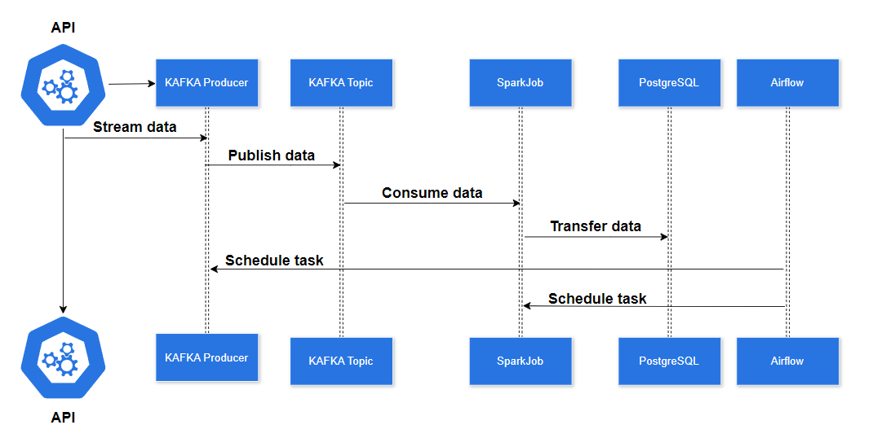
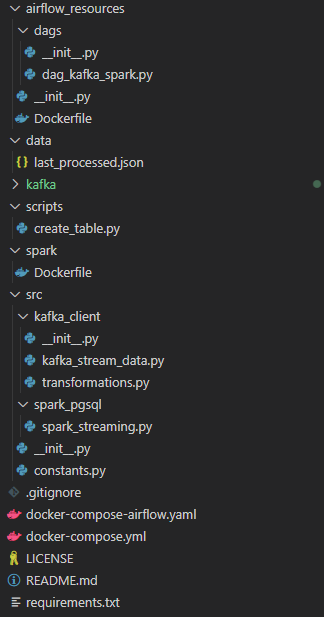
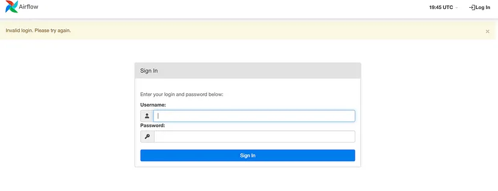
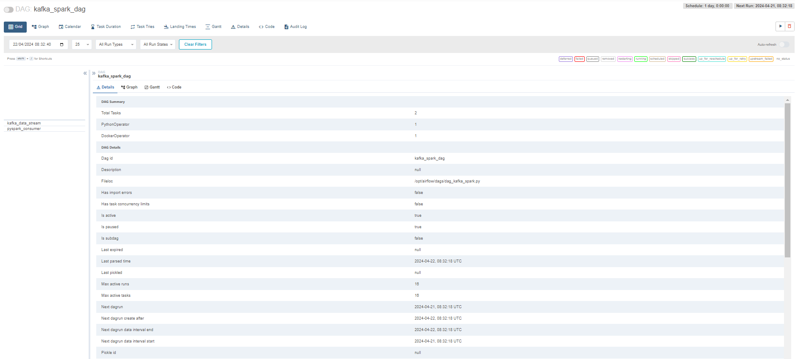
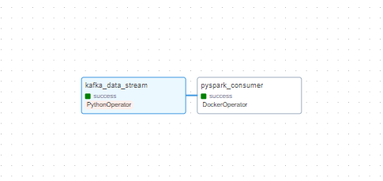
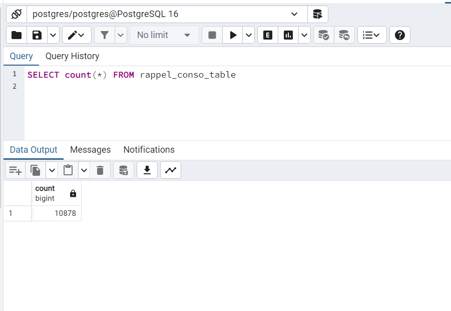

# Pipeline Data Engineering con Kafka, Spark, Airflow, Postgres y Docker
Este proyecto se centra en la construcción de un data pipeline usando Kafka, Airflow, Spark y PostgreSQL
## Descripción General:

1. Data Streaming: Los datos se transmiten desde una API a un topic de Kafka
2. Data Processing: Spark job procesa la data desde el topic de Kafka y lo transmite a db PostgreSQL.
3. Scheduling with Airflow: Tanto la tarea de transmisión y los jobs de spark son orquestados por Airflow. Para la demostración, se programará el producer kafka para que se ejecute diariamente. En un escenario real, el producer deberia estar escuchando constantemente a la API.

Todas las herramientas se construiran y se ejecutarán usando docker-compose



### Local Setup
En primer lugar, puedes clonar del repositorio de Github en tu máquina local usando el siguiente comando:
```bash
git clone git@github.com:antonyper/Pipeline-DataEngineer.git
```
Estructura del proyecto:



- El directorio *airflow_resources* contiene un Dockerfile personalizado para configurar el airflow y un directorio de dags para crear y programar las task.
- El directorio *data* contiene el archivo last_processed.json que es importante para el kafka streaming.
- El archivo *docker-compose-airflow.yaml* define los servicios requeridos para correr airflow.
- El archivo *docker-compose.yaml* especifica los servicios kafka e incluye el docker-proxy. El proxy es esencial para la ejecución de los Sprak jobs a traves del operador docker de Airflow.
- El directorio *spark* contiene un dockerfile personalizado para la configuración de Spark.
- *src* contiene los modulos de python requeridos para correr la aplicación
Para configurar tu entorno de desarrollo local, empieza instalando los packages de python requeridos. Para instalar todos los packages, puedes usar el siguiente comando:
```bash
pip install -r requirements.txt
```
### Detalles sobre la API
La API es de RappelConso de los servicios públicos franceses. Da acceso a los datos realacionados con retiradas de productos declarados por profesionales en Francia. Los datos son inicialmente 31 columnas y están en francés. Los más importantes son los siguientes:

- *reference_fiche* (Hoja de referencia)*:*  Identificador único del producto retirado. Actúa como la primary key en PostgreSQL database
- *categorie_de_produit* (Categoría de producto): **Por ejemplo:  food, electrical appliance, tools, transport means, etc.
- *sous_categorie_de_produit* (Sub categoría de producto): Por ejemplo: meat, dairy products, cereals como subproductos de la categoría food.
- *motif_de_rappel* (Motivo de retiro): Uno de los campos más importantes
- *date_de_publication* fecha de publicación.
- *risques_encourus_par_le_consommateur* riesgos del consumidor puede tener al utilizar el producto.
- También hay otros campos que corresponden al diferentes links, como el link de la imagen del producto, link de la lista de distribuidores, etc.

Puedes ver más ejemplos y realizar querys al dataser usando el siguiente [link](https://data.economie.gouv.fr/explore/dataset/rappelconso0/api/?disjunctive.categorie_de_produit&sort=date_de_publication)

Se redefinirá las columnas de la data de la siguiente manera:

- Las columnas `ndeg_de_version` y `rappelguid` que son parte de un sistema de versiones, se removerá porque no se usará en el proyecto.
- Se combinará las columnas que tratan sobre los riesgos del consumidor (`risques_encourus_par_le_consommateur` y `description_complementaire_du_risque`) para obtener una descripción más clara.
- La columna `date_debut_fin_de_commercialisation` que indica el periodo de comercialización, se dividirá en dos columnas para realizar querys de una forma más fácil.
- Se removerá los acentos de todas las columnas excepto las que hacen referencia a números o fechas. Es importante por un tema de calidad y para herramientas de procesamiento de texto.

Se tiene el script de transformación `src/kafka_client/transformactions.py`. La lista de columnas esta disponible en`src/constants.py`en DB_FIELDS.
### kafka streaming

Para evitar enviar todos los datos del la API cada vez que se ejecute la tara de streaming, se define un archivo json que contiene la ultima fecha de publicación del último streaming. Se usará esta fecha como fecha de inicio para la tarea de streaming.

El archivo se guarda en `./data/last_processed.json` en el siguiente formato:
```bash
{last_processed:"2024-04-18"}
```

De forma predeterminada, el archivo json está vació, lo que significa que la primera tarea de streaming se procesará todos los registros de la API.

Para un entorno de producción guardar la fecha en una archivo local no es viable. Usar otros enfoques como una base de datos externa o un servicio de almacenamiento de objetos es más adecuado.

El código para la transmisión de Kafka se puede encontrar en `/src/kafka_client/kafka_stream_data.py` e implica principalmente consultar los datos de la API, realizar las transformaciones, eliminar posibles duplicados, actualizar la última fecha de publicación y entregar los datos usando Kafka productor.
El siguiente paso es ejecutar el servicio Kafka definido en Docker-Compose definido a continuación:

```Dockerfile
version: '3'

services:
  kafka:
    image: 'bitnami/kafka:latest'
    ports:
      - '9094:9094'
    networks:
      - airflow-kafka
    environment:
      - KAFKA_CFG_NODE_ID=0
      - KAFKA_CFG_PROCESS_ROLES=controller,broker
      - KAFKA_CFG_LISTENERS=PLAINTEXT://:9092,CONTROLLER://:9093,EXTERNAL://:9094
      - KAFKA_CFG_ADVERTISED_LISTENERS=PLAINTEXT://kafka:9092,EXTERNAL://localhost:9094
      - KAFKA_CFG_LISTENER_SECURITY_PROTOCOL_MAP=CONTROLLER:PLAINTEXT,EXTERNAL:PLAINTEXT,PLAINTEXT:PLAINTEXT
      - KAFKA_CFG_CONTROLLER_QUORUM_VOTERS=0@kafka:9093
      - KAFKA_CFG_CONTROLLER_LISTENER_NAMES=CONTROLLER
    volumes:
      - ./kafka:/bitnami/kafka

  kafka-ui:
    container_name: kafka-ui-1
    image: provectuslabs/kafka-ui:latest
    ports:
      - 8800:8080  
    depends_on:
      - kafka
    environment:
      KAFKA_CLUSTERS_0_NAME: local
      KAFKA_CLUSTERS_0_BOOTSTRAPSERVERS: PLAINTEXT://kafka:9092
      DYNAMIC_CONFIG_ENABLED: 'true'
    networks:
      - airflow-kafka

networks:
  airflow-kafka:
    external: true
```

El archivo se puede descomponer de la siguiente manera:

- El servicio kafka utiliza la imagen `bitnami/kafka`.
- Se configura con un solo broker que es sufuciente para este proyecto. Un broker de kafka es responsable de recibir los mensajes de los producer, almacenarlos y entregarlos a los consumers. Utiliza el puerto 9092 para la comunicación interna y el puerto 9094 para la comunicación externa.
- Se asigna el directorio local kafka al directorio del contenedor acoplable /bitnami/kafka para garantizar la persistencia de los datos y una posible inspección de los datos de Kafka desde el sistema host.
- Se configura el servicio kafka-ui que utiliza la imagen provectuslabs/kafka-ui:latest. Esto proporciona una interfaz de usuario para interactuar con el clúster de kafka.
- Para asegurar la comunicación entre kafka y airflow se ejecutará como un servicio externo, se utilizará la red `airflow-kafka`

Antes de correr el servicio kafka, primero se debe crear la red airflow-kafka usando el siguiente comando:

```bash
docker network create airflow-kafka
```

Ahora, con la red creada, se levanta el servicio de kafka

```bash
docker-compose up 
```

Una vez levantado los servicios, creamos un Topic Kafka de la siguiente manera

```bash
docker exec -it data-engineering-project-kafka-1 /bin/bash

kafka-topics.sh --create --bootstrap-server localhost:9092 --replication-factor 1 --partitions 1 --topic rappel-conso

```

Como solo tenemos un broker, configuramos el replication factor en 1. Configuramos partitions en 1 dado que solo tenemos un solo consumidor a la vez por lo que no necesitamos ningun paralelismo. Finalmente configuramos el tiempo que se retiene la data a una hora.

### Configuración del Postgres

Antes de configurar Spark y Airflow, primero se creará una base de datos donde se almacenará los datos de la API. Se ha utilizado la herramienta pgadmin 4 para este proyecto.

Para instalar postgres y pgadmin, visite este enlace https://www.postgresql.org/download/ y obtenga los paquetes según su sistema operativo. Luego, al instalar Postgres, debe configurar una contraseña que necesitaremos más adelante para conectarnos a la base de datos desde el entorno Spark. También puedes salir del puerto en 5432.

Una vez completado al configuración, debería verse de la siguiente manera:

Se utilizará la librería psycopg2 que es un adaptador de PostgreSQL para python.

Corremos el siguiente comando:

```bash
python scripts/create_table.py

```

Tenga en cuenta que en el script se guadó la contraseña de Postgres como variable de entorno y se nombró POSTGRES_PASSWORD. Entonces, si se utiliza otro método para acceder a la contraseña, deberá de modificarse el script en consecuencia.

### Configuración Spark

Luego de configurar la base de datos de Posrgres, se va a detallar los jobs de Spark. El objetivo es transmitir los datos del topic de kafka rappel_conso a la tabla de Postgres rappel_conso_table.

Para ello se tiene el siguiente código:

```python
from pyspark.sql import SparkSession
from pyspark.sql.types import (
    StructType,
    StructField,
    StringType,
)
from pyspark.sql.functions import from_json, col
from src.constants import POSTGRES_URL, POSTGRES_PROPERTIES, DB_FIELDS
import logging

logging.basicConfig(
    level=logging.INFO, format="%(asctime)s:%(funcName)s:%(levelname)s:%(message)s"
)

def create_spark_session() -> SparkSession:
    spark = (
        SparkSession.builder.appName("PostgreSQL Connection with PySpark")
        .config(
            "spark.jars.packages",
            "org.postgresql:postgresql:42.5.4,org.apache.spark:spark-sql-kafka-0-10_2.12:3.5.0",

        )
        .getOrCreate()
    )

    logging.info("Spark session created successfully")
    return spark

def create_initial_dataframe(spark_session):
    """
    Reads the streaming data and creates the initial dataframe accordingly.
    """
    try:
        # Gets the streaming data from topic random_names
        df = (
            spark_session.readStream.format("kafka")
            .option("kafka.bootstrap.servers", "kafka:9092")
            .option("subscribe", "rappel_conso")
            .option("startingOffsets", "earliest")
            .load()
        )
        logging.info("Initial dataframe created successfully")
    except Exception as e:
        logging.warning(f"Initial dataframe couldn't be created due to exception: {e}")
        raise

    return df

def create_final_dataframe(df):
    """
    Modifies the initial dataframe, and creates the final dataframe.
    """
    schema = StructType(
        [StructField(field_name, StringType(), True) for field_name in DB_FIELDS]
    )
    df_out = (
        df.selectExpr("CAST(value AS STRING)")
        .select(from_json(col("value"), schema).alias("data"))
        .select("data.*")
    )
    return df_out

def start_streaming(df_parsed, spark):
    """
    Starts the streaming to table spark_streaming.rappel_conso in postgres
    """
    # Read existing data from PostgreSQL
    existing_data_df = spark.read.jdbc(
        POSTGRES_URL, "rappel_conso", properties=POSTGRES_PROPERTIES
    )

    unique_column = "reference_fiche"

    logging.info("Start streaming ...")
    query = df_parsed.writeStream.foreachBatch(
        lambda batch_df, _: (
            batch_df.join(
                existing_data_df, batch_df[unique_column] == existing_data_df[unique_column], "leftanti"
            )
            .write.jdbc(
                POSTGRES_URL, "rappel_conso", "append", properties=POSTGRES_PROPERTIES
            )
        )
    ).trigger(once=True) \
        .start()

    return query.awaitTermination()

def write_to_postgres():
    spark = create_spark_session()
    df = create_initial_dataframe(spark)
    df_final = create_final_dataframe(df)
    start_streaming(df_final, spark=spark)

if __name__ == "__main__":
    write_to_postgres()
```

El código se puede dividir en las siguientes partes:
 1.  En primer lugar, se crea la Spark session en la función `create_spark_session()`

1. Luego, en la función create_initial_dataframe se ingesta el streaming data de topic de kafka usando una estructura de spark.
2. Una vez la data ingestada, sen la función `create_final_dataframe` se transforma. Se applica un esquema a los datos entrantes json, definido por las columnas en DB_FIELDS, asegurando que los datos estén estructurados y listos para procesar.
3. En la función start_streaming. se lee la data existente en la base de datos, se compara con la data entrante, y se añade las nuevas filas.

El código completo se encuentra en el archivo  `src/spark_pgsql/spark_streaming.py`. Se usará Airflow DockerOperator para ejecutar este trabajo.

Se repasa el proceso de creación de la imagen de Docker que necesitamos para ejecutar el job Spark. Se muestra el Dockerfile como referencia:

```Dockerfile
FROM bitnami/spark:latest

WORKDIR /opt/bitnami/spark

RUN pip install py4j

COPY ./src/spark_pgsql/spark_streaming.py ./spark_streaming.py
COPY ./src/constants.py ./src/constants.py

ENV POSTGRES_DOCKER_USER=host.docker.internal
ENV POSTGRES_PASSWORD="admin"
```

En este dockerfile, empieza con la imagen `bitname/spark` como base, luego se instala py4j, una herramienta necesaria para trabajar spark con python.

Las variables de entorno `POSTGRES_DOCKER_USER` y`POSTGRES_PASSWORD` son configurados para conectarse a la base da tos PostgreSQL. Como la base de datos esta en la máquina local, se utiliza host.docker.internal como user. 

Ahora, se crea la imagen:

```bash
docker buildx build -f spark/Dockerfile -t rappel-conso/spark:latest .
```

### Airflow

Como se mencionó anteriormente, Apache Airflow siver como una herramienta de orquestación de data pipeline. Es responsable de programar y gestionar el flujo de trabajo de los jobs, asegurando que se ejecuten en un orden específico y en condiciones definidos. En este sistema, Airflow se utiliza para automatizar el flujo de datos desde la transmisión con kafka hasta el procesamiento con Spark.

### Airflow DAG

Observamos  el Directed Acyclic Graph (DAG) que describe la secuencia y dependencias en las tareas, lo que permitirá a Airflow gestionar su ejecución.

 

```bash
start_date = datetime.today() - timedelta(days=1)

default_args = {
    "owner": "airflow",
    "start_date": start_date,
    "retries": 1,  # number of retries before failing the task
    "retry_delay": timedelta(seconds=5),
}

with DAG(
    dag_id="kafka_spark_dag",
    default_args=default_args,
    schedule_interval=timedelta(days=1),
    catchup=False,
) as dag:

    kafka_stream_task = PythonOperator(
        task_id="kafka_data_stream",
        python_callable=stream,
        dag=dag,
    )

    spark_stream_task = DockerOperator(
        task_id="pyspark_consumer",
        image="rappel-conso/spark:latest",
        api_version="auto",
        auto_remove=True,
        command="./bin/spark-submit --master local[*] --packages org.postgresql:postgresql:42.5.4,org.apache.spark:spark-sql-kafka-0-10_2.12:3.5.0 ./spark_streaming.py",
        docker_url='tcp://docker-proxy:2375',
        environment={'SPARK_LOCAL_HOSTNAME': 'localhost'},
        network_mode="airflow-kafka",
        dag=dag,
    )

    kafka_stream_task >> spark_stream_task
```

Se explica algunos elementos clave de esta configuración:

- La tarea se ha configurado para ejecutarse diariamente.
- La primera tarea es **Kafka Stream Task.** Se ha implementado usando PythonOperator que corre la función de streaming kafka. Esta tarea transmite la data de la API RappelConso hacia el Topic de Kafka. inciando el workflow de procesamiento de los datos.
- la siguiente tarea es **Spark Stream Task** usa el DockerOperator para su ejecución. Corre el contenedor docker con la imágen personalizada Spark, encargado de procesar los datos recibidos de kafka.
- Los tareas son ordenadas secuencialmente, este orden es crucial para asegurar que primero se transmite y se carga primero en kafka y luevo se procesa en spark.

### DockerOperator

El uso del operador Docker nos permite ejecutar contenedores Docker que correspondan a las tareas. La principal ventaja de este enfoque es una gestión de paquetes más sencilla, un mejor aislamiento y una mayor capacidad de prueba. 

Algunos puntos claves sobre el operador en la tarea de spark streaming:

- Se usa la imagen `rappel-conso/spark:latest` en la configuración de spark.
- El comando ejecutará el envio de spark dentro del contenedor, especificando el maestro como local, incluidos los paquetes necesarios para la integración de PostgreSQL y Kafka y apunta al script `spark_streaming.py` que contiene la lógica del trabajo.
- `Docker_url` representa la url del host donde se está corriendo el docker daemon. La solución natural es configurarlo como  `unix://var/run/docker.sock` y montar `var/run/docker.sock` en el contenedor de airflow. Un problema que se tiene con este enfoque es el permiso denegado de usar un archivo socket dentro del contenedor airflow. La solución sería cambiar los permisos con `chmod 777 var/run/docker.sock`, pero se tiene riesgos de seguridad importantes. Para evitar esto, implementamos una solución más segura utilizando bobrik/socat como docker-proxy. Este proxy, definido en el servicio docker-compose, escucha el puerto TCP 2375 y reenvía solicitudes al socket docker.

```Dockerfile
 docker-proxy:
    image: bobrik/socat
    command: "TCP4-LISTEN:2375,fork,reuseaddr UNIX-CONNECT:/var/run/docker.sock"
    ports:
      - "2376:2375"
    volumes:
      - /var/run/docker.sock:/var/run/docker.sock
    networks:
      - airflow-kafka
```

- Finalmente, se utiliza la network airflow-kafka. Esto permite el uso de la misma network que el proxy y el docker que ejecuta kafka. Esto es crucial para que la tarea de spark consuma los datos desde el topic kafka, por lo que es importante asegurar que los contenedores se puedan comunicar.

### Configuración Airflow

El archivo compose de airflow fue adaptado del archivo oficial de apache airflow docker-compose. 

La versión propuesta de airflow consume muchos recursos dado que el ejecutor central está configurado en CeleryExecutor, que está más adaptado para tareas de procesamiento de datos distribuidos a gran escala. Dado que ahora se tiene una carga de trabajo pequeña, se usará el LocalExecutor de un solo nodo es suficiente.

Algunos puntos a aclarar sobre los cambios hechos:

- Se configura la variablea de entorno AIRFLOW__CORE__EXECUTOR como LocalExecutor
- Se elimina el servicio airflow-worker y flowes porque solo se usan para el Celery executor. Tambien se elmina el servicio de redis en caché ya que funciona como backend para Celery. Tambien se elimina airflow-triggerer.
- Se reemplaza la imagen base ${AIRFLOW_IMAGE_NAME:-apache/airflow:2.7.3} para los servicios restantes, principalmente el programador y el servidor web, por una imagen personalizada que crearemos cuando ejecutemos docker-compose.

```Dockerfile
version: '3.8'
x-airflow-common:
  &airflow-common
  build:
    context: .
    dockerfile: ./airflow_resources/Dockerfile
  image: de-project/airflow:latest
```

- Montamos los volúmenes necesarios que necesita airflow. AIRFLOW_PROJ_DIR designa el directorio del proyecto de fairflow que definiremos más adelante. También configuramos la red como airflow-kafka para poder comunicarnos con los servidores kafka boostrap.

```Dockerfile
volumes:
  - ${AIRFLOW_PROJ_DIR:-.}/dags:/opt/airflow/dags
  - ${AIRFLOW_PROJ_DIR:-.}/logs:/opt/airflow/logs
  - ${AIRFLOW_PROJ_DIR:-.}/config:/opt/airflow/config
  - ./src:/opt/airflow/dags/src
  - ./data/last_processed.json:/opt/airflow/data/last_processed.json
user: "${AIRFLOW_UID:-50000}:0"
networks:
  - airflow-kafka
```

A continuación, necesitamos crear algunas variables de entorno que utilizará Docker-Compose:

```bash
echo -e "AIRFLOW_UID=$(id -u)\nAIRFLOW_PROJ_DIR=\"./airflow_resources\"" > .env
```

Donde AIRFLOW_UID representa la ID de usuario en los contenedores de airflow y AIRFLOW_PROJ_DIR representa el directorio del proyecto de airflow.

Ahora, ya todo configurado, ejecutamos el servicio de airflow:

```bash
echo -e "AIRFLOW_UID=$(id -u)\nAIRFLOW_PROJ_DIR=\"./airflow_resources\"" > .env

```

La interface de acceso de airflow webservice es http://localhost:8800



El usuario y contraseña por defecto es airflow.



Se puede dar start al DAG: kafka_spark_dag

Ahora, se puede revisar el status de las tareas en las ventana Graph. Si la tarea está hecha se tornará verde:



Para verificar que la tabla  `rappel_conso_table` esta llena de datos, se puede usar la siguiente SQL query en pgAdmin Query Tool:

```sql
SELECT count(*) FROM rappel_conso_table
```

Podemos observar:



### Conclusión

- En este proyecto se demuestra paso a paso la construccion paso a paso de un pipeline de ingenieria de datos usando kafka, airflow, spark, PostgreSQL y Docker.
- A lo largo de este proyecto, se cubre cada componente del pipeline a detalle, desde la configuración de kafka para data streaming usando Airflow para las tareas de orquestación y para el procesamiento de datos Spark, guardándolo en PostgreSQL. El uso de docker en todo el proyecto simplifica la configuración y garantiza la coherencia en diferentes entornos.
